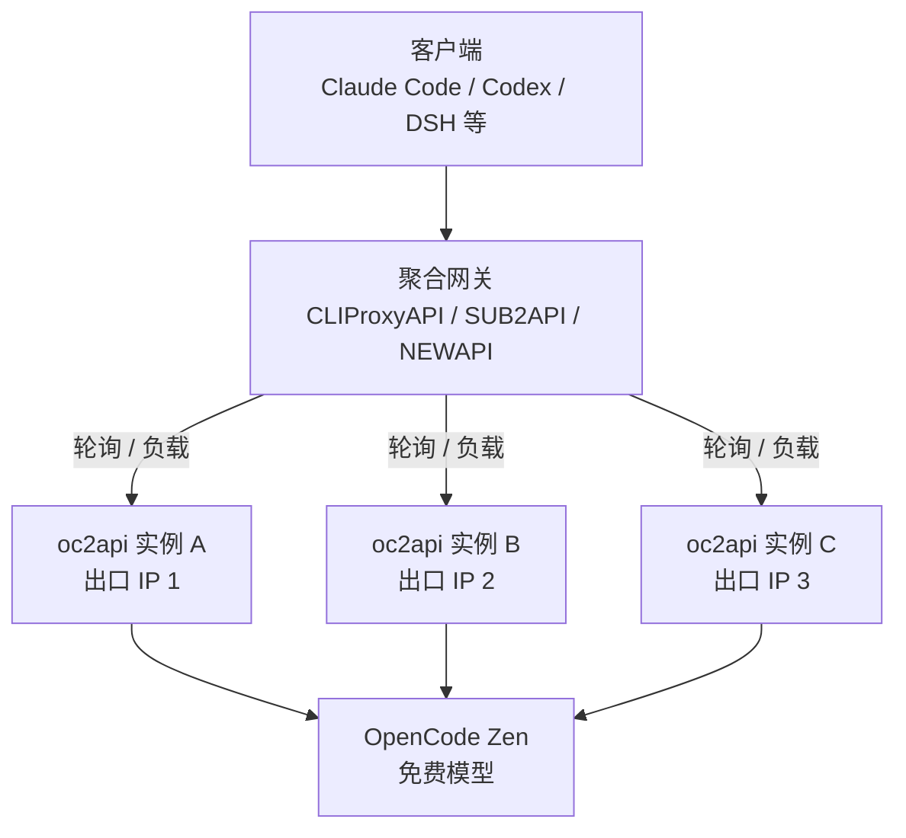

# oc2api

> ⚠️ **2026-08-21 提醒**：`deepseek-v4-flash-free` 模型已官方下线，不再提供免费额度。如需使用请更换其他模型，建议用 `big-pickle` 和 `mimo-v2.6-flash-free`，其中 `mimo-v2.6-flash-free` 支持图片输入。

OpenCode Free API 代理，使用一套 Express 业务逻辑，同时支持本地运行、Docker 和 Vercel 部署，并支持 SSE 流式响应。



## Vercel 部署

### 一键部署

[](https://vercel.com/new/clone?repository-url=https%3A%2F%2Fgithub.com%2Fzhuweiyou%2Foc2api&env=API_KEY%2CDEBUG&envDefaults=%7B%22API_KEY%22%3A%22sk-zhu%22%2C%22DEBUG%22%3A%22true%22%7D&envDescription=API_KEY%EF%BC%9AAPI%20%E5%AF%86%E9%92%A5%EF%BC%88%E7%95%99%E7%A9%BA%E5%88%99%E5%8C%BF%E5%90%8D%E8%AE%BF%E9%97%AE%EF%BC%89%EF%BC%9BDEBUG%EF%BC%9A%E8%AE%BE%E4%B8%BA%20true%20%E5%BC%80%E5%90%AF%E8%B0%83%E8%AF%95%E6%97%A5%E5%BF%97&envLink=https%3A%2F%2Fgithub.com%2Fzhuweiyou%2Foc2api%23vercel-%E9%83%A8%E7%BD%B2)

### 手动部署

1. Fork 本仓库到你的 GitHub
2. 打开 [Vercel Dashboard](https://vercel.com)，点击 **Add New > Project**
3. 选择你 Fork 的仓库，点击 **Import**
4. 在 **Environment Variables** 中添加：
   - `API_KEY` — API 密钥（留空则匿名访问）
   - `DEBUG` — 设为 `true` 开启调试日志（可选）
5. 点击 **Deploy**，等待部署完成

部署完成后会得到一个 `https://<项目名>.vercel.app` 的域名。

你可以 Fork 后部署多个 Vercel Project，在 [router-for-me/CLIProxyAPI](https://github.com/router-for-me/CLIProxyAPI)、[Wei-Shaw/sub2api](https://github.com/Wei-Shaw/sub2api)、[QuantumNous/new-api](https://github.com/QuantumNous/new-api) 等聚合网关中配置多个域名，实现轮询、负载分摊。多个项目不保证出口 IP 不同，需通过各实例的 `/ip` 核对；独立出口取决于实际部署。

## 本地运行

要求 Node.js 24 或更高版本。

```bash
npm install
npm start
```

默认监听 `http://localhost:8080`。也可以通过环境变量配置：

```bash
API_KEY=your-key DEBUG=true PORT=8080 npm start
```

可选的本地上游中继（例如 proxy-router）可以在 OC2API 转换响应前处理限流重试：

```sh
ZEN_API_BASE_URL=http://127.0.0.1:2082/v1 ZEN_CONNECT_TIMEOUT_MS=300000 npm start
```

`ZEN_API_BASE_URL` 默认是 `https://opencode.ai/zen/v1`，同时用于模型列表和聊天。
`ZEN_CONNECT_TIMEOUT_MS` 默认是 60000 毫秒，允许 1–600000；中继重试时应设置为大于其恢复窗口。
它只控制收到响应头之前的等待时间，后续流式读取仍使用已有的超时机制。

健康检查：

```bash
curl http://localhost:8080/health
```

## Docker 部署

Docker 配置位于项目根目录：

```bash
docker compose up -d --build
```

## 测试

离线测试不访问 OpenCode：

```bash
npm test
```

真实联调包含 9 个用例：非流式回答、流式多轮对话、禁用工具、实际工具调用、工具结果回填，以及三个并行工具调用。全部首轮成功时至少发送 10 次 `big-pickle` 请求，工具自主选择的有限重试会增加请求数。Vercel 用例通过本地 HTTP 服务加载其入口，不等于远程 Vercel 部署验收：

```bash
npm run test:live
```

离线运行时联调用例跳过；显式启用联调后，HTTP 错误、超时、协议错误和未能实际调用工具均视为失败，不能用 skip 冒充通过。每个用例总预算为 120 秒，单次请求最多 90 秒；工具选择最多尝试三次，但仍受用例总预算约束。真实上游限流也会使联调失败，不影响离线测试。

## 代码检查

```bash
npm run lint          # ESLint 静态检查
npm run format:check  # 检查格式是否规范
npm run format        # 用 Prettier 自动格式化全部文件
```

GitHub Actions 与 Docker 构建都会先执行 lint 和格式检查，不通过则构建失败。

## API

兼容 OpenAI API 格式，路径均支持带 `/v1` 前缀或不带：

| 路径                                          | 方法 | 说明                                  |
| --------------------------------------------- | ---- | ------------------------------------- |
| `/v1/chat/completions` 或 `/chat/completions` | POST | Chat 补全（支持 `stream: true` 流式） |
| `/v1/models` 或 `/models`                     | GET  | 模型列表                              |
| `/` 或 `/health`                              | GET  | 健康检查                              |
| `/ip`                                         | GET  | 查询出口 IP                           |

配置 API Key 后，请求携带：

```text
Authorization: Bearer <api-key>
```

也支持 `X-API-Key`。

## 免费模型限制

代理仅放行免费模型（`big-pickle` 及所有以 `-free` 结尾的模型），以 `big-pickle` 为例：

```json
{
  "id": "big-pickle",
  "limit": {
    "context": 200000,
    "output": 32000
  }
}
```

- `context`：最大上下文窗口，**200,000** tokens
- `output`：最大单次输出长度，**32,000** tokens

以上限制数据来源于接口 [https://models.opencode.ai/api.json](https://models.opencode.ai/api.json)（`opencode` key 下对应模型的 `limit` 字段），可自行查看核实，以实际使用为准。

聊天上游返回 HTTP 错误或流解析失败时，在下游响应头尚未发送前归一为 `429`，便于账号池切换；流式头已发送后只能返回 SSE 错误事件，且不补 `[DONE]`。建连网络失败、建连超时及模型列表错误仍沿用原有的 `502` / `504` 分类。
